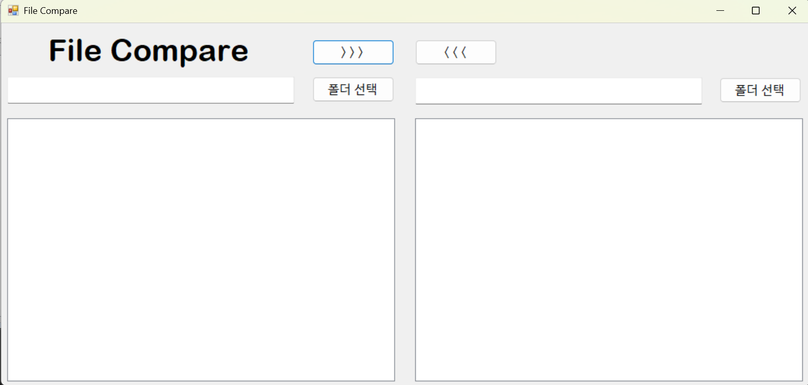
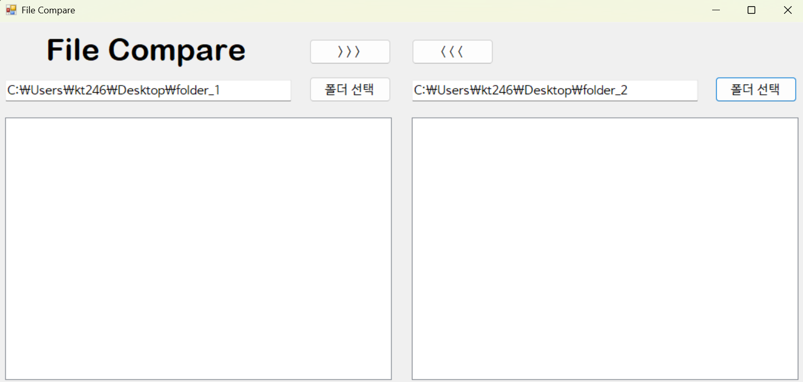

# (C# 코딩) FileCompare

## 개요
- C# 프로그래밍 학습
- 1줄 소개: 두 개의 폴더를 선택하여 파일 목록을 비교하고 관리할 수 있는 프로그램
- 사용한 플랫폼:
  - C#, .NET Windows Forms, Visual Studio, GitHub
- 사용한 컨트롤:
  - SplitContainer, Panel, Label, TextBox, Button, ListView
- 사용한 기술과 구현한 기능:
  - SplitContainer를 활용한 화면 분할 UI 구성
  - Panel을 활용한 영역별 레이아웃 구성
  - ListView를 활용한 파일 목록 표시 기능

- 수업 중에 배우고 사용했던 클래스들 관련된 설명
  - SplitContainer 클래스: 화면을 좌우로 분할하여 두 영역을 구성하는 데 사용한다.
  - Panel 클래스: UI를 영역별로 나누어 배치하는 데 사용한다.
  - ListView 클래스: 폴더 내 파일 목록을 표시하는 데 사용한다.
  - TextBox 클래스: 경로 입력 및 표시를 위해 사용한다.
  - Button 클래스: 폴더 선택 및 기능 실행을 위해 사용한다.

- 실습 중에 구현한 기능들 설명
  - 좌우 폴더 경로 입력 및 선택 UI 구성
  - 파일 목록을 표시하는 ListView 구성
  - 버튼을 통한 기능 실행 인터페이스 구성

## 실행 화면 (과제1)
- 과제1 코드의 실행 스크린샷

  

  

- 과제 내용
  - SplitContainer를 활용하여 화면을 좌우로 분할하여 구성한다.
  - TextBox와 Button을 활용하여 폴더 경로 입력 및 선택 UI를 구성한다.
  - ListView를 활용하여 폴더 내 파일 목록을 표시할 수 있도록 구성한다.
  - FolderBrowserDialog를 활용하여 폴더를 선택할 수 있도록 구성한다.
  - 각 컨트롤의 이름을 기능에 맞게 설정한다.

- 구현 내용과 기능 설명
  - SplitContainer를 활용한 좌우 영역 분할 UI 구성 기능 구현
  - TextBox와 Button을 통한 폴더 경로 입력 및 선택 기능 구현
  - FolderBrowserDialog를 활용한 폴더 선택 기능 구현
  - 선택한 폴더 경로를 TextBox에 표시하는 기능 구현
  - 컨트롤 이름을 기능에 맞게 설정