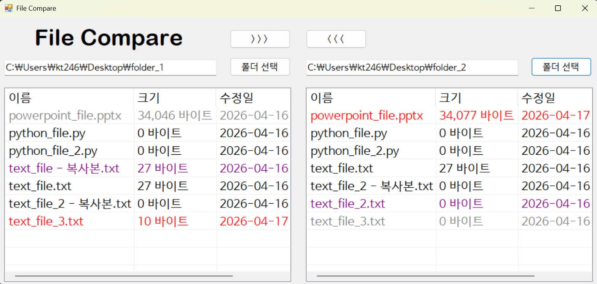
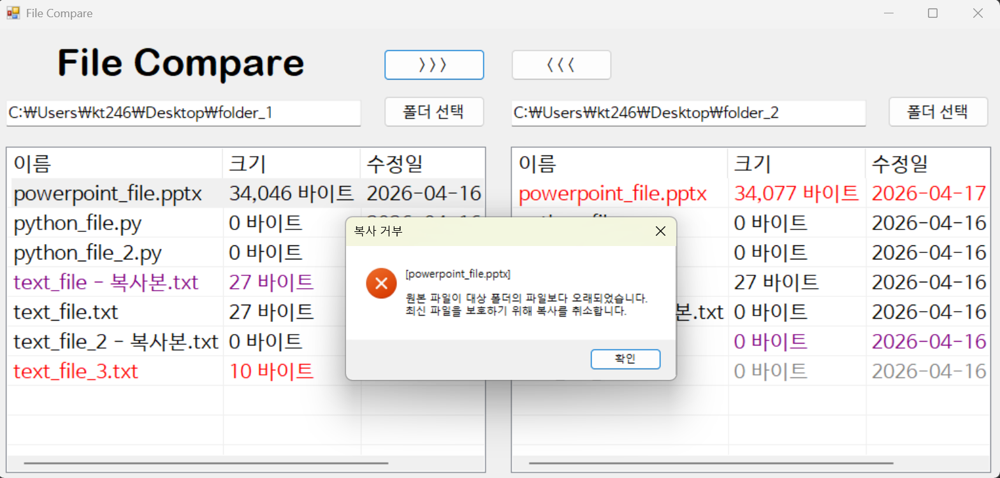
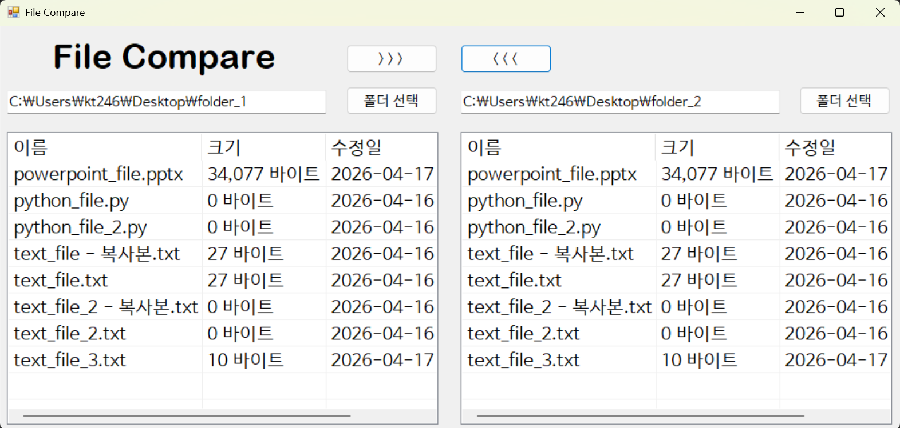

# (C# 코딩) FileCompare

## 개요
- C# 프로그래밍 학습
- 1줄 소개: 두 개의 폴더를 선택하여 파일 목록을 비교하고 복사까지 수행할 수 있는 프로그램
- 사용한 플랫폼:
  - C#, .NET Windows Forms, Visual Studio, GitHub
- 사용한 컨트롤:
  - SplitContainer, Panel, Label, TextBox, Button, ListView
- 사용한 기술과 구현한 기능:
  - SplitContainer를 활용한 화면 분할 UI 구성
  - Panel을 활용한 영역별 레이아웃 구성
  - ListView를 활용한 파일 목록 및 비교 결과 표시 기능
  - 파일 수정 시간 비교를 통한 상태 구분 및 색상 표시 기능
  - 선택 파일을 기준으로 폴더 간 복사 기능 구현

- 수업 중에 배우고 사용했던 클래스들 관련된 설명
  - SplitContainer 클래스: 화면을 좌우로 분할하여 두 폴더를 동시에 비교할 수 있도록 구성하는 데 사용한다.
  - Panel 클래스: 각 영역의 UI를 구조적으로 나누고 정렬하는 데 사용한다.
  - ListView 클래스: 파일 이름, 크기, 수정일 등의 정보를 목록 형태로 출력하는 데 사용한다.
  - TextBox 클래스: 폴더 경로를 입력하고 표시하는 데 사용한다.
  - Button 클래스: 폴더 선택 및 파일 복사 등의 기능을 실행하는 데 사용한다.

- 실습 중에 구현한 기능들 설명
  - 좌우 폴더 선택 및 경로 표시 기능 구현
  - 선택한 폴더의 파일 및 폴더 목록을 ListView에 출력하는 기능 구현
  - 파일 비교를 통해 동일/이전/최신/고유 파일을 색상으로 구분하는 기능 구현
  - 선택한 파일을 반대편 폴더로 복사하는 기능 구현
  - 오래된 파일이 최신 파일을 덮어쓰지 못하도록 제한하는 기능 구현

## 실행 화면 (과제1)
- 과제1 코드의 실행 스크린샷

  

  

- 과제 내용
  - SplitContainer를 활용하여 화면을 좌우로 분할하여 구성한다.
  - TextBox와 Button을 활용하여 폴더 경로 입력 및 선택 UI를 구성한다.
  - ListView를 활용하여 폴더 내 파일 목록을 표시할 수 있도록 구성한다.
  - FolderBrowserDialog를 활용하여 폴더를 선택할 수 있도록 구성한다.
  - 각 컨트롤의 이름을 기능에 맞게 설정한다.

- 구현 내용과 기능 설명
  - SplitContainer를 활용한 좌우 영역 분할 UI 구성 기능 구현
  - TextBox와 Button을 통한 폴더 경로 입력 및 선택 기능 구현
  - FolderBrowserDialog를 활용한 폴더 선택 기능 구현
  - 선택한 폴더 경로를 TextBox에 표시하는 기능 구현
  - 컨트롤 이름을 기능에 맞게 설정

## 실행 화면 (과제2)  
- 과제2 코드의 실행 스크린샷  

  

- 과제 내용  
  - 폴더 선택 기능을 구현하여 사용자가 원하는 경로를 선택할 수 있도록 구성한다.  
  - 선택한 폴더의 파일 및 폴더 목록을 ListView에 표시하도록 구성한다.  
  - 양쪽 폴더의 파일을 비교하여 상태에 따라 색상으로 구분하여 표시하도록 구성한다.  

- 구현 내용과 기능 설명  
  - FolderBrowserDialog를 활용한 폴더 선택 기능 구현  
  - 선택한 경로의 파일 및 폴더 정보를 ListView에 출력하는 기능 구현  
  - 파일 비교를 통해 동일 파일(검정), 이전 파일(회색), 최신 파일(빨강)으로 구분하는 기능 구현  
  - 한쪽 폴더에만 존재하는 파일을 보라색으로 표시하는 기능 구현  
  - 파일의 수정 시간과 크기 정보를 함께 출력하는 기능 구현  
  - 컬럼 자동 크기 조절을 통해 가독성을 높이는 기능 구현 
 
 ## 실행 화면 (과제3)  
- 과제3 코드의 실행 스크린샷  

  

  

- 과제 내용  
  - 선택한 파일을 기준으로 양쪽 폴더 간 파일 복사 기능을 구현한다.  
  - ListView에서 선택한 파일을 반대편 폴더로 복사할 수 있도록 구성한다.  
  - 최신 파일 보호를 위해 오래된 파일이 덮어쓰지 않도록 제한 기능을 구현한다.  

- 구현 내용과 기능 설명  
  - ListView에서 선택한 파일을 기준으로 복사 기능 구현  
  - 버튼 클릭을 통해 좌우 폴더 간 파일 복사 기능 구현  
  - 대상 폴더에 동일 파일이 존재할 경우 수정 시간 비교 기능 구현  
  - 원본 파일이 더 오래된 경우 경고 메시지 출력 및 복사 차단 기능 구현  
  - 파일 복사 완료 후 양쪽 ListView를 갱신하는 기능 구현  